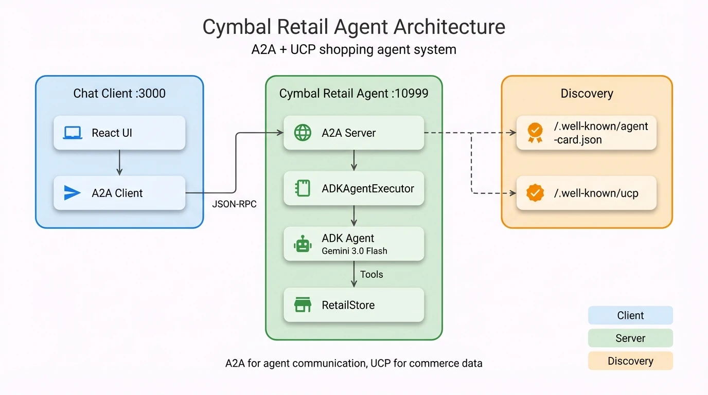

# Cymbal Retail Agent - Developer Guide

## TL;DR

- **ADK Agent** with 8 shopping tools (search, checkout, payment) using Gemini 3.0 Flash
- **UCP Integration** for standardized commerce data types and capability negotiation
- **A2A Protocol** for agent discovery and JSON-RPC messaging

## About This Guide

This guide is for developers who want to understand how the sample works internally.

**Prerequisites:** Complete the [Quick Start in README.md](README.md#quick-start) first.

**What you'll learn:**
- System architecture and component responsibilities
- How UCP and A2A protocols integrate with ADK
- The checkout state machine and commerce flows
- How to extend and customize the sample

## Reading Roadmap

Choose your path based on your goal:

| Goal | Start Here | Then Read |
|------|------------|-----------|
| **New to AI agents?** | [Glossary](docs/00-glossary.md) | This guide → 01-architecture |
| **Understand the system** | [Architecture](docs/01-architecture.md) | 02-adk-agent → 03-ucp-integration |
| **Add a new tool** | [ADK Agent](docs/02-adk-agent.md) | 06-extending |
| **Modify checkout flow** | [Commerce Flows](docs/04-commerce-flows.md) | 06-extending |
| **Customize the UI** | [Frontend](docs/05-frontend.md) | - |
| **Debug an issue** | [Testing Guide](docs/07-testing-guide.md) | - |
| **Deploy to production** | [Production Notes](docs/08-production-notes.md) | - |
| **Use AI assistant** | [SKILLS.md](SKILLS.md) | Context for Claude Code, Gemini CLI, Cursor, Codex |

## Architecture

  
  
<em>System architecture — Chat Client (React + A2A Client) communicates via JSON-RPC to the Cymbal Retail Agent (A2A Server → ADKAgentExecutor → ADK Agent → RetailStore). Discovery endpoints expose agent capabilities and UCP profile.</em>

## Quick Reference

### Key Files

| File | Purpose |
|------|---------|
| `business_agent/src/business_agent/agent.py` | ADK agent + 8 tools |
| `business_agent/src/business_agent/store.py` | Checkout state machine |
| `business_agent/src/business_agent/agent_executor.py` | A2A ↔ ADK bridge |
| `chat-client/App.tsx` | React app + A2A messaging |

### Endpoints

| Endpoint | Purpose |
|----------|---------|
| `GET /.well-known/agent-card.json` | A2A agent discovery |
| `GET /.well-known/ucp` | UCP merchant profile |
| `POST /` | A2A JSON-RPC endpoint |

### State Keys

| Key | Purpose |
|-----|---------|
| `user:checkout_id` | Current checkout session |
| `__ucp_metadata__` | Negotiated capabilities |
| `__payment_data__` | Payment instrument |

## Deep Dive Guides

| Guide | Topics |
|-------|--------|
| [Glossary](docs/00-glossary.md) | Key terms, acronyms, state keys |
| [Architecture](docs/01-architecture.md) | System components, data flow |
| [ADK Agent](docs/02-adk-agent.md) | Tools, callbacks, session management |
| [UCP Integration](docs/03-ucp-integration.md) | Capabilities, profiles, negotiation |
| [Commerce Flows](docs/04-commerce-flows.md) | Checkout lifecycle, payment |
| [Frontend](docs/05-frontend.md) | React components, A2A client |
| [Extending](docs/06-extending.md) | Add tools, products, capabilities |
| [Testing Guide](docs/07-testing-guide.md) | Testing, debugging, troubleshooting |
| [Production Notes](docs/08-production-notes.md) | Security gaps, deployment checklist |
