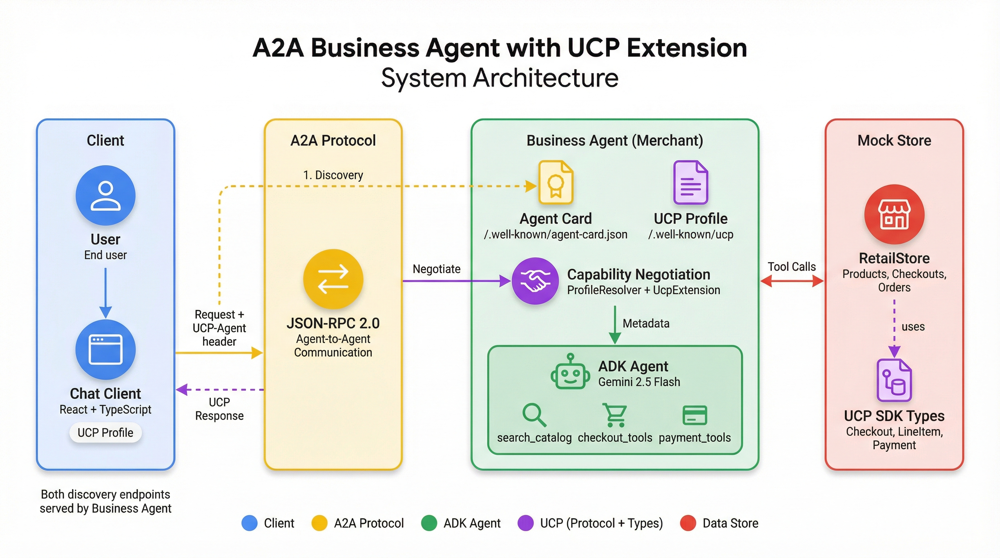
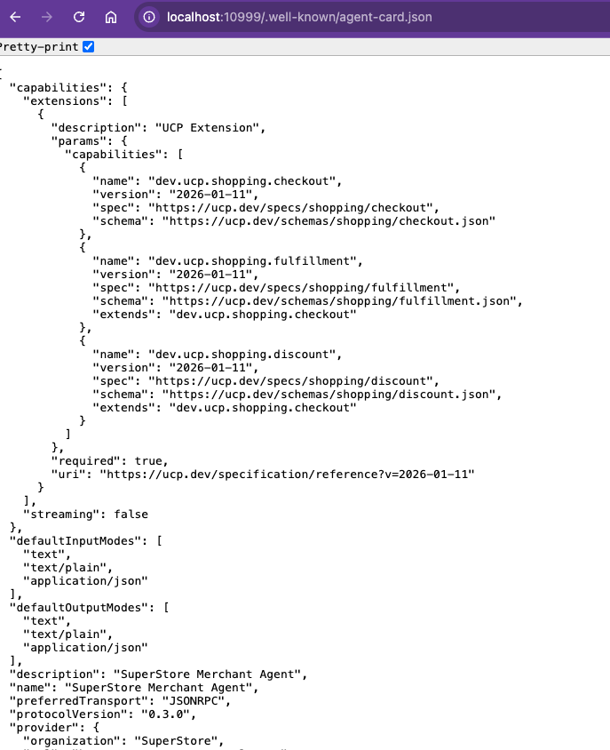
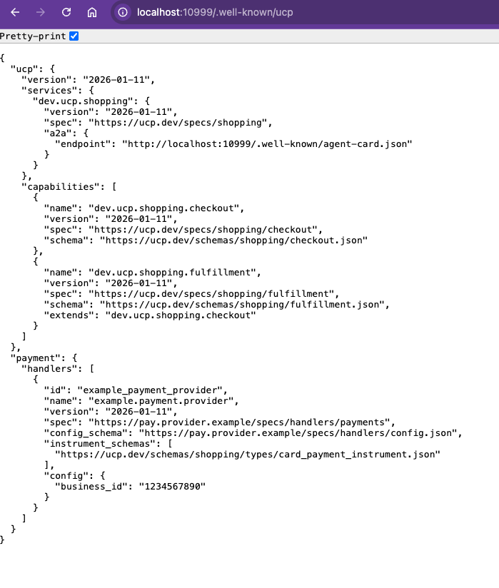

<!--
   Copyright 2026 UCP Authors

   Licensed under the Apache License, Version 2.0 (the "License");
   you may not use this file except in compliance with the License.
   You may obtain a copy of the License at

       http://www.apache.org/licenses/LICENSE-2.0

   Unless required by applicable law or agreed to in writing, software
   distributed under the License is distributed on an "AS IS" BASIS,
   WITHOUT WARRANTIES OR CONDITIONS OF ANY KIND, either express or implied.
   See the License for the specific language governing permissions and
   limitations under the License.
-->

# A2A Business Agent with UCP Extension

This sample demonstrates how to build an AI-powered shopping assistant using **[Universal Commerce Protocol (UCP)](https://ucp.dev)** - an open standard that enables interoperability between commerce platforms, merchants, and payment providers.

UCP provides standardized data types for the entire commerce transaction lifecycle: product discovery, checkout sessions, fulfillment options, payment processing, and order confirmation. By implementing UCP, your commerce agent can communicate with any UCP-compatible client or platform using a common vocabulary.

The sample uses **[Google ADK](https://google.github.io/adk-docs/)** (Agent Development Kit) to build the AI agent and **[A2A Protocol](https://google.github.io/A2A/)** (Agent-to-Agent) for agent discovery and communication.

<table>
<tr><td colspan="2" align="center"><b>Key Features</b></td></tr>
<tr><td>🛒</td><td><b>UCP Checkout Capability:</b> Implements <code>dev.ucp.shopping.checkout</code> for checkout, line items, totals, and order creation with standardized status lifecycle (<code>incomplete</code> → <code>ready_for_complete</code> → <code>completed</code>).</td></tr>
<tr><td>📦</td><td><b>UCP Fulfillment Capability:</b> Implements <code>dev.ucp.shopping.fulfillment</code> for shipping address collection, delivery options, and fulfillment method selection.</td></tr>
<tr><td>💳</td><td><b>UCP Payment Handling:</b> Supports <code>PaymentInstrument</code> types with configurable payment handlers and merchant business configuration via UCP profile.</td></tr>
<tr><td>🤝</td><td><b>Capability Negotiation:</b> Client and merchant exchange UCP profiles at <code>/.well-known/ucp</code> to agree on supported features before transactions begin.</td></tr>
<tr><td>🤖</td><td><b>Google ADK Agent:</b> Gemini 2.5 Flash model with 8 shopping tools (search, checkout, payment) demonstrating how to build UCP-aware agents.</td></tr>
<tr><td>🔗</td><td><b>A2A Protocol:</b> Agent discovery via <code>/.well-known/agent-card.json</code> and JSON-RPC 2.0 communication - showing UCP as an A2A extension.</td></tr>
<tr><td>💻</td><td><b>React Chat Client:</b> TypeScript UI that renders UCP data types (Checkout, LineItem, PaymentResponse, OrderConfirmation) with proper capability handling.</td></tr>
</table>

## Demo

<p align="center">
<b>Complete Shopping Flow</b><br/>
<i>Product search → Add items to Checkout → Payment → Order confirmation</i>
<br/><br/>

<br/><br/>
<a href="https://github.com/user-attachments/assets/8d3d17f5-dbcc-4cc8-91b9-2b7d48b3f2df">▶️ Watch the full demo video</a>
</p>

## Architecture

<p align="center">
<b>System Architecture</b><br/>
<i>How Client, A2A Protocol, Business Agent, and Store interact</i>
<br/><br/>

</p>

**Key points:**
- **Client** sends requests with `UCP-Agent` header containing its profile URL
- **Business Agent** serves both `/.well-known/agent-card.json` (A2A) and `/.well-known/ucp` (UCP Profile)
- **Capability Negotiation** happens before processing - agent and client agree on supported features
- **RetailStore** uses UCP SDK types internally for checkout, fulfillment, and payment data

## Quick Start

> ⏱️ **Setup time:** ~5 minutes

### Prerequisites

Before you begin, ensure you have:

- [ ] Python 3.13+ with [UV](https://docs.astral.sh/uv/)
- [ ] Node.js 18+
- [ ] [Gemini API Key](https://aistudio.google.com/apikey)

### 1. Start the Business Agent

```bash
cd a2a/business_agent
uv sync
cp env.example .env
```

Edit `.env` and add your `GOOGLE_API_KEY`, then start the agent:

```bash
uv run business_agent
```

**Expected output:**
```
INFO:     Started server process
INFO:     Uvicorn running on http://0.0.0.0:10999
```

This starts the business agent on port 10999. You can verify by accessing:
- **Agent Card:** http://localhost:10999/.well-known/agent-card.json
- **UCP Profile:** http://localhost:10999/.well-known/ucp

<details>
<summary>📸 <b>Server Endpoints (click to expand)</b></summary>
<br/>
<table>
<tr>
<td width="50%" align="center">
<b>Agent Card</b><br/><code>/.well-known/agent-card.json</code>
<br/><br/>

<br/><i>Declares UCP extension with capabilities</i>
</td>
<td width="50%" align="center">
<b>UCP Profile</b><br/><code>/.well-known/ucp</code>
<br/><br/>

<br/><i>Defines supported capabilities & payment handlers</i>
</td>
</tr>
</table>
</details>

### 2. Start the Chat Client

In a new terminal:

```bash
cd a2a/chat-client
npm install
npm run dev
```

**Expected output:**
```
VITE v5.x.x ready
➜ Local: http://localhost:3000/
```

The Chat Client UCP Profile can be found at http://localhost:3000/profile/agent-profile.json

### 3. Try It Out

<table>
<tr>
<td width="50%" align="center">

<br/><a href="https://github.com/user-attachments/assets/8d3d17f5-dbcc-4cc8-91b9-2b7d48b3f2df">▶️ Watch full video</a>
</td>
<td width="50%" valign="top">

1. Navigate to http://localhost:3000
2. Type `"show me cookies available in stock"` and press enter
3. The agent will return products available in stock
4. Click **"Add to Checkout"** for any product
5. The agent will ask for required information such as email address, shipping address, etc.
6. Once the required information is provided, click **"Complete Payment"**
7. The UI shows available mock payment options
8. Select a payment method and click **"Confirm Purchase"**
9. The agent will create an order and return the order confirmation

</td>
</tr>
</table>

## What is UCP?

**Universal Commerce Protocol (UCP)** is an open standard that enables interoperability between commerce platforms, merchants, and payment providers. It provides standardized data types for commerce transactions.

This sample uses the following UCP capabilities:
- `dev.ucp.shopping.checkout` - Checkout session management with status lifecycle: `incomplete` → `ready_for_complete` → `completed`
- `dev.ucp.shopping.fulfillment` - Shipping and delivery handling
- `dev.ucp.shopping.discount` - Discount and promotional codes

[Learn more about UCP](https://ucp.dev)

## Technology Stack

| Technology | Purpose | Used For |
|------------|---------|----------|
| **[Google ADK](https://google.github.io/adk-docs/)** | Agent Framework | AI agent with tools, Gemini LLM integration, session management |
| **[A2A Protocol](https://a2a-protocol.org/latest/)** | Communication | Agent discovery via Agent Card, JSON-RPC messaging, task management |
| **[UCP](https://ucp.dev)** | Commerce Standard | Standardized product, checkout, payment, and order data types |

## Components

### Business Agent (`business_agent/`)

AI shopping assistant built with Google ADK, exposed via A2A interface with UCP extension.

| File | Purpose |
|------|---------|
| `agent.py` | ADK Agent with Gemini 2.5 Flash + 8 shopping tools |
| `agent_executor.py` | Bridges ADK ↔ A2A protocol |
| `store.py` | Mock RetailStore (products, checkouts, orders) |
| `data/ucp.json` | UCP Profile served at `/.well-known/ucp` |

### Chat Client (`chat-client/`)

React UI (TypeScript, Vite, Tailwind) that communicates via A2A and renders UCP data types.

| File | Purpose |
|------|---------|
| `App.tsx` | A2A messaging + state management |
| `components/` | ProductCard, Checkout, PaymentMethodSelector |
| `profile/agent_profile.json` | Client's UCP capabilities |

## Mock Store

The business agent uses an in-memory `RetailStore` to simulate a real backend:

- **Products** - Loaded from `data/products.json` (cookies, chips, fruits, etc.)
- **Checkouts** - Session-based checkout management with line items
- **Orders** - Created when checkout completes successfully
- **Payments** - Mock processor simulates payment flow

Prices are in USD, tax is calculated at 10%, and shipping costs vary by method.

## Related Resources

- [UCP Specification](https://ucp.dev/specification/overview/)
- [Google ADK Documentation](https://google.github.io/adk-docs/)
- [A2A Protocol Specification](https://a2a-protocol.org/latest/specification/)
- [UCP Python SDK](https://github.com/Universal-Commerce-Protocol/python-sdk)

## Disclaimer

This is an example implementation for demonstration purposes and is not intended for production use.
