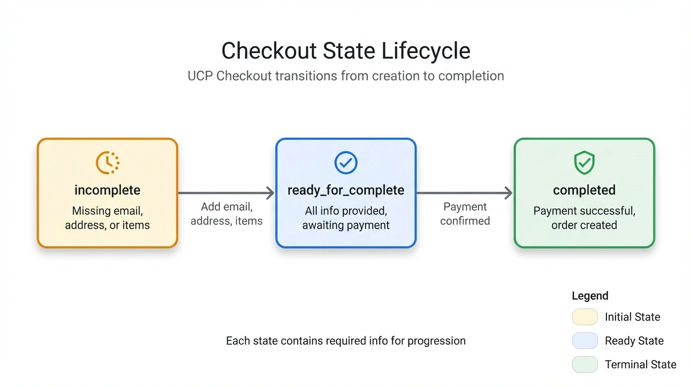
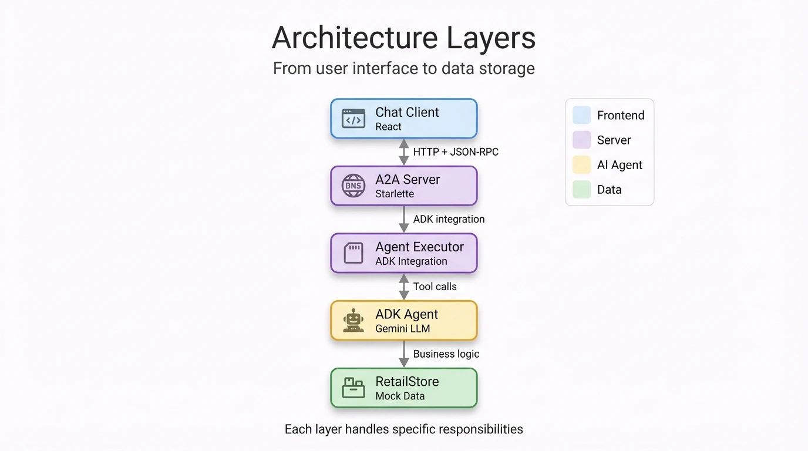

# Glossary

Quick reference for key terms used throughout this documentation.

## TL;DR

- **A2A** = How agents talk to each other (discovery + messaging)
- **UCP** = Standard data types for commerce (Checkout, LineItem, Payment)
- **ADK** = Google's framework for building AI agents

---

## Core Concepts

| Term | Definition | Example in This Sample |
|------|------------|------------------------|
| **A2A** | Agent-to-Agent Protocol - How AI agents discover and communicate with each other | `/.well-known/agent-card.json` endpoint |
| **UCP** | Universal Commerce Protocol - Standard data types for commerce transactions | `Checkout`, `LineItem`, `PaymentInstrument` |
| **ADK** | Agent Development Kit - Google's framework for building agents with tools | `Agent()`, `ToolContext`, `Runner` |
| **Agent** | In this sample: the Cymbal Retail Agent service (includes LLM + tools + state) | The backend running on port 10999 |
| **Tool** | A Python function the LLM can invoke to perform actions | `search_shopping_catalog()`, `add_to_checkout()` |
| **Capability** | A feature set the agent supports, declared in UCP profile | `dev.ucp.shopping.checkout` |
| **Negotiation** | Client and merchant agreeing on shared capabilities before transacting | Happens when first message is sent |

---

## Protocol Terms

| Term | What It Does | Where to Find It |
|------|--------------|------------------|
| **Agent Card** | JSON file declaring agent identity and capabilities | `/.well-known/agent-card.json` |
| **UCP Profile** | JSON file declaring commerce capabilities and payment handlers | `/.well-known/ucp` |
| **JSON-RPC 2.0** | Message format used for A2A communication | Request/response structure in A2A calls |
| **UCP-Agent Header** | HTTP header containing client's profile URL | Sent with every A2A request |

---

## State Management

State is stored in ADK's session service (in-memory by default).

| Key | Purpose | Lifetime |
|-----|---------|----------|
| `user:checkout_id` | Current checkout session ID | Until checkout completed or session expires |
| `__ucp_metadata__` | Negotiated capabilities from client/merchant profiles | Set once per session |
| `__payment_data__` | Payment instrument for current checkout | Set during payment flow |
| `__session_extensions__` | Active A2A extensions for this session | Set once per session |
| `temp:LATEST_TOOL_RESULT` | Temporary storage for last UCP tool response | Cleared after each agent response |

**Naming conventions**:
- `user:` prefix — User-scoped data (persists across turns)
- `__` prefix — System/internal data (managed by framework)
- `temp:` prefix — Temporary data (cleared after use)

---

## Checkout States

The checkout follows a 3-state lifecycle:

  
  
<em>Figure 1: Checkout state transitions from incomplete → ready_for_complete → completed</em>

| State | Meaning | What's Needed to Progress |
|-------|---------|---------------------------|
| `incomplete` | Missing required info | Add email, address, or items |
| `ready_for_complete` | Ready for payment | User confirms payment |
| `completed` | Order placed successfully | Terminal state - checkout finalized |

---

## ADK Components

| Component | Role | File |
|-----------|------|------|
| **Agent** | Orchestrates LLM and tools | `agent.py` |
| **Tool** | Individual function the LLM can call | Defined in `agent.py` |
| **ToolContext** | Provides state access to tools | Passed to each tool function |
| **Runner** | Executes agent with session management | `InMemoryRunner` |
| **Session** | Stores conversation history and state | `InMemorySessionService` |
| **Callback** | Hook to modify tool/agent output | `after_tool_callback`, `after_agent_callback` |

---

## Architecture Layers

  
  
<em>Figure 2: Vertical stack from Chat Client through A2A Server, Agent Executor, ADK Agent, to RetailStore</em>

---

## Common Acronyms

| Acronym | Full Name | Context |
|---------|-----------|---------|
| A2A | Agent-to-Agent | Protocol for agent communication |
| UCP | Universal Commerce Protocol | Commerce data standard |
| ADK | Agent Development Kit | Google's agent framework |
| LLM | Large Language Model | Gemini 3.0 Flash in this sample |
| SDK | Software Development Kit | UCP Python SDK |

---

## External Resources

Official documentation for the core technologies used in this sample.

### ADK (Agent Development Kit)

| Resource | URL |
|----------|-----|
| **Official Docs** | [google.github.io/adk-docs](https://google.github.io/adk-docs/) |
| **Getting Started** | [ADK Get Started Guide](https://google.github.io/adk-docs/get-started/) |
| **Agents Guide** | [Building Agents](https://google.github.io/adk-docs/agents/) |
| **GitHub (Python SDK)** | [github.com/google/adk-python](https://github.com/google/adk-python) |
| **Google Cloud Docs** | [Vertex AI Agent Builder](https://docs.cloud.google.com/agent-builder/agent-development-kit/overview) |

### A2A (Agent-to-Agent Protocol)

| Resource | URL |
|----------|-----|
| **Official Protocol Site** | [a2a-protocol.org](https://a2a-protocol.org/latest/) |
| **Specification** | [A2A Specification](https://a2a-protocol.org/latest/specification/) |
| **ADK Integration** | [ADK with A2A](https://google.github.io/adk-docs/a2a/) |
| **GitHub Repository** | [github.com/a2aproject/A2A](https://github.com/a2aproject/A2A) |
| **Google Cloud Docs** | [A2A Agents on Cloud Run](https://docs.cloud.google.com/run/docs/ai/a2a-agents) |

### UCP (Universal Commerce Protocol)

| Resource | URL |
|----------|-----|
| **Official Site** | [ucp.dev](https://ucp.dev/) |
| **Specification Overview** | [UCP Specification](https://ucp.dev/specification/overview/) |
| **Developer Guide** | [Google Merchant UCP Guide](https://developers.google.com/merchant/ucp) |
| **GitHub Repository** | [github.com/Universal-Commerce-Protocol/ucp](https://github.com/Universal-Commerce-Protocol/ucp) |
| **Python SDK** | [github.com/Universal-Commerce-Protocol/python-sdk](https://github.com/Universal-Commerce-Protocol/python-sdk) |

### Related Technologies

| Technology | Documentation |
|------------|---------------|
| **Gemini API** | [ai.google.dev/gemini-api/docs](https://ai.google.dev/gemini-api/docs) |
| **MCP (Model Context Protocol)** | [modelcontextprotocol.io](https://modelcontextprotocol.io/) |
| **JSON-RPC 2.0** | [jsonrpc.org/specification](https://www.jsonrpc.org/specification) |

---

## Related Documentation

- [Architecture Overview](01-architecture.md) - System components
- [ADK Agent Guide](02-adk-agent.md) - Tool and callback patterns
- [UCP Integration](03-ucp-integration.md) - Capability negotiation
- [Commerce Flows](04-commerce-flows.md) - Checkout state machine
