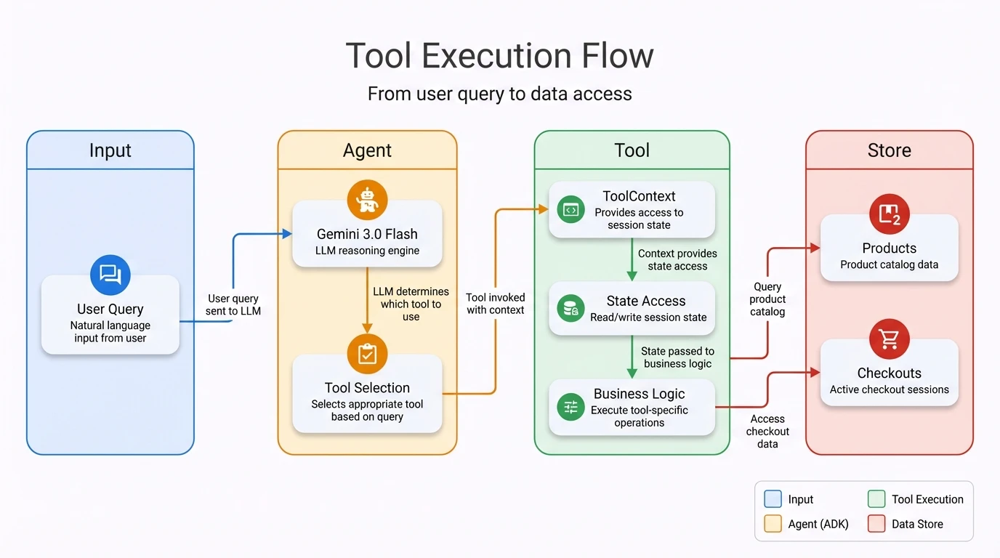
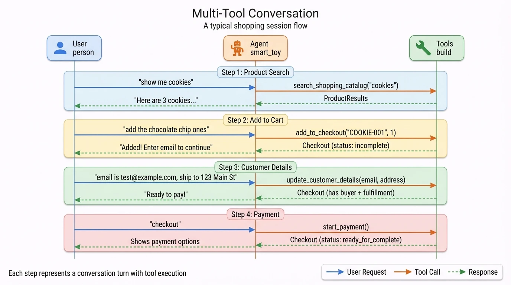

# ADK Agent Patterns

## TL;DR

- **Agent**: Gemini 3.0 Flash with 8 shopping tools
- **Tools**: Access `ToolContext` for state, return dict with UCP keys
- **Callbacks**: `after_tool_callback` captures results, `after_agent_callback` formats output

## Agent Configuration

```python
# agent.py:437
root_agent = Agent(
    name="shopper_agent",
    model="gemini-3-flash-preview",
    description="Agent to help with shopping",
    instruction="You are a helpful agent who can help user with shopping...",
    tools=[
        search_shopping_catalog,
        add_to_checkout,
        remove_from_checkout,
        update_checkout,
        get_checkout,
        start_payment,
        update_customer_details,
        complete_checkout,
    ],
    after_tool_callback=after_tool_modifier,
    after_agent_callback=modify_output_after_agent,
)
```

## Tool Pattern

Every tool follows this pattern:

```python
def tool_function(tool_context: ToolContext, param: str) -> dict:
    """Docstring visible to LLM for reasoning."""

    # 1. Get state
    checkout_id = tool_context.state.get(ADK_USER_CHECKOUT_ID)
    metadata = tool_context.state.get(ADK_UCP_METADATA_STATE)

    # 2. Validate
    if not metadata:
        return _create_error_response("Missing UCP metadata")

    # 3. Execute business logic
    try:
        result = store.method(...)
    except ValueError as e:
        return _create_error_response(str(e))

    # 4. Update state if needed
    tool_context.state[ADK_USER_CHECKOUT_ID] = result.id

    # 5. Return UCP-formatted response
    return {UCP_CHECKOUT_KEY: result.model_dump(mode="json")}
```

## All 8 Tools

| Tool | Line | Purpose | State Access |
|------|------|---------|--------------|
| `search_shopping_catalog` | 51 | Search products | Read metadata |
| `add_to_checkout` | 73 | Add item to cart | Read/write checkout_id |
| `remove_from_checkout` | 115 | Remove item | Read checkout_id |
| `update_checkout` | 151 | Update quantity | Read checkout_id |
| `get_checkout` | 187 | Get current state | Read checkout_id |
| `update_customer_details` | 212 | Set buyer/address | Read checkout_id |
| `start_payment` | 340 | Begin payment flow | Read checkout_id |
| `complete_checkout` | 270 | Finalize order | Read checkout_id, payment |

## Tool Execution Flow

<div align="center">
  
  <p><em>Figure 1: Tool execution flow from user query through the ADK Agent (LLM + Tool Selection), Tool execution (ToolContext, State, Business Logic), to the data store (Products, Checkouts).</em></p>
</div>

The flow illustrates how each tool invocation works:

- **Input** — User's natural language query enters the system
- **Agent** — Gemini 3.0 Flash reasons about the query and selects the appropriate tool
- **Tool** — ToolContext provides state access, then business logic executes
- **Store** — Products and Checkouts data are queried or modified

### Multi-Tool Conversation Flow

In a typical shopping session, multiple tools are called across turns:

<div align="center">
  
  <p><em>Figure 2: A complete shopping conversation showing 4 steps — product search, add to cart, customer details, and payment initiation. Each step involves tool execution and state updates.</em></p>
</div>

**The 4-step shopping flow:**

1. **Product Search** — User asks for cookies → `search_shopping_catalog` returns ProductResults
2. **Add to Cart** — User selects item → `add_to_checkout` creates Checkout (status: incomplete)
3. **Customer Details** — User provides email/address → `update_customer_details` adds buyer + fulfillment
4. **Payment** — User says "checkout" → `start_payment` sets status to ready_for_complete

## Callbacks

### Why Callbacks?

ADK callbacks solve a key problem: **the LLM sees tool results as text, but the frontend needs structured data**.

Without callbacks:
- Tool returns `{UCP_CHECKOUT_KEY: {...checkout data...}}`
- LLM summarizes: "Added cookies to your cart for $4.99"
- Frontend only sees text, can't render checkout UI

With callbacks:
- `after_tool_callback` captures the structured data in state
- `after_agent_callback` attaches it to the response as a `data` part
- Frontend receives both text AND structured data for rich UI

### after_tool_callback

Captures UCP data from tool results for later use:

```python
# agent.py:379
def after_tool_modifier(
    tool: BaseTool,
    args: dict[str, Any],
    tool_context: ToolContext,
    tool_response: dict,
) -> dict | None:
    """Stores UCP responses in state for output transformation."""
    extensions = tool_context.state.get(ADK_EXTENSIONS_STATE_KEY, [])
    ucp_response_keys = [UCP_CHECKOUT_KEY, "a2a.product_results"]

    # Only capture if UCP extension is active
    if UcpExtension.URI in extensions and any(
        key in tool_response for key in ucp_response_keys
    ):
        tool_context.state[ADK_LATEST_TOOL_RESULT] = tool_response

    return None  # Don't modify the response
```

### after_agent_callback

Transforms agent output to include structured data:

```python
# agent.py:408
from google.genai import types

def modify_output_after_agent(
    callback_context: CallbackContext,
) -> types.Content | None:
    """Adds UCP data parts to agent's response."""
    latest_result = callback_context.state.get(ADK_LATEST_TOOL_RESULT)
    if latest_result:
        # Create function response with UCP data
        return types.Content(
            parts=[
                types.Part(
                    function_response=types.FunctionResponse(
                        response={"result": latest_result}
                    )
                )
            ],
            role="model",
        )
    return None
```

## Session & State Management

### State Keys

```python
# constants.py
ADK_USER_CHECKOUT_ID = "user:checkout_id"      # Checkout session ID
ADK_PAYMENT_STATE = "__payment_data__"          # Payment instrument
ADK_UCP_METADATA_STATE = "__ucp_metadata__"     # Capabilities
ADK_EXTENSIONS_STATE_KEY = "__session_extensions__"
ADK_LATEST_TOOL_RESULT = "temp:LATEST_TOOL_RESULT"
```

### State Flow

1. **Request arrives** → Executor builds initial state delta
2. **Tools execute** → Read/write state via `tool_context.state`
3. **Callbacks fire** → Capture results in state
4. **Response sent** → State persisted in session

## ADK → A2A Bridge

`ADKAgentExecutor` bridges the protocols:

```python
# agent_executor.py
class ADKAgentExecutor:
    async def execute(self, context, event_queue):
        # 1. Activate extensions
        self._activate_extensions(context)

        # 2. Prepare UCP metadata
        ucp_metadata = UcpRequestProcessor.prepare_ucp_metadata(context)

        # 3. Extract input
        query, payment_data = self._prepare_input(context)

        # 4. Build message content
        content = types.Content(
            role="user", parts=[types.Part.from_text(text=query)]
        )

        # 5. Build state delta
        state_delta = self._build_initial_state_delta(
            context, ucp_metadata, payment_data
        )

        # 6. Run agent (async iterator)
        async for event in self.runner.run_async(
            user_id=user_id,
            session_id=session_id,
            new_message=content,
            state_delta=state_delta,
        ):
            if event.is_final_response():
                # Process final response parts
                result_parts = self._process_event(event)

        # 7. Enqueue response
        event_queue.enqueue(result_parts)
```

## Prompt Engineering

### Current System Instruction

The agent uses a single instruction (`agent.py:441-454`):

```python
instruction=(
    "You are a helpful agent who can help user with shopping actions such"
    " as searching the catalog, add to checkout session, complete checkout"
    " and handle order placed event. Given the user ask, plan ahead and"
    " invoke the tools available to complete the user's ask. Always make"
    " sure you have completed all aspects of the user's ask. If the user"
    " says add to my list or remove from the list, add or remove from the"
    " cart, add the product or remove the product from the checkout"
    " session. If the user asks to add any items to the checkout session,"
    " search for the products and then add the matching products to"
    " checkout session. If the user asks to replace products,"
    " use remove_from_checkout and add_to_checkout tools to replace the"
    " products to match the user request"
)
```

### Improving the Instruction

For production agents, consider structured prompting with explicit tool ordering and error handling:

```python
instruction="""
You are a shopping assistant for Cymbal Retail. Help users find products
and complete purchases.

TOOLS (use in this order when applicable):
1. search_shopping_catalog - Always search first when user asks for products
2. add_to_checkout - Add items after finding them
3. update_customer_details - Collect email and address before payment
4. start_payment - Begin payment when customer info is complete
5. complete_checkout - Finalize after payment is confirmed

RULES:
- Always search before adding items (don't guess product IDs)
- Never assume addresses or payment methods - ask the user
- If a tool returns an error, explain it clearly and suggest next steps
- Confirm quantities and prices before proceeding to payment

ERROR HANDLING:
- "Product not found" → Ask user to clarify product name or show alternatives
- "Missing address" → Politely ask for shipping address
- "Checkout not found" → Help user add items first
- "Payment declined" → Explain and offer to try different payment method
"""
```

### Model Configuration

| Setting | Current Value | Purpose |
|---------|---------------|---------|
| `model` | `gemini-3-flash-preview` | Fast, accurate tool calling |
| `temperature` | Default (not set) | Balanced creativity vs determinism |
| `max_tokens` | Default (not set) | Response length limit |

**Model Selection Guide:**

| Model | Best For | Tradeoff |
|-------|----------|----------|
| Gemini 3.0 Flash | Tool-heavy agents (this sample) | Fastest, 99% tool accuracy |
| Gemini 2.0 Pro | Complex reasoning, ambiguous queries | Slower, better nuanced understanding |

To change the model, edit `agent.py:437`:

```python
root_agent = Agent(
    model="gemini-2-flash",  # or other model ID
    ...
)
```

### Tool Docstring Best Practices

The LLM uses tool docstrings to decide when to call each tool. Clear docstrings improve tool selection accuracy:

```python
# GOOD: Clear, specific docstring
def search_shopping_catalog(tool_context: ToolContext, query: str) -> dict:
    """Search the product catalog for items matching the query.

    Use this tool when the user asks about products, wants to browse items,
    or needs to find something to buy.

    Args:
        query: Product name, category, or description to search for.
               Examples: "cookies", "chocolate chip", "snacks under $5"

    Returns:
        List of matching products with names, prices, and availability.
    """

# BAD: Vague docstring
def search_shopping_catalog(tool_context: ToolContext, query: str) -> dict:
    """Search products."""  # LLM won't know when to use this
```

## Adding a New Tool

1. **Define function** with `ToolContext` parameter:

```python
def my_new_tool(tool_context: ToolContext, param: str) -> dict:
    """Description for LLM reasoning."""
    # Implementation
    return {UCP_CHECKOUT_KEY: result.model_dump(mode="json")}
```

2. **Add to agent**:

```python
root_agent = Agent(
    ...
    tools=[...existing..., my_new_tool],
)
```

3. **Update instruction** if needed to guide LLM usage.
