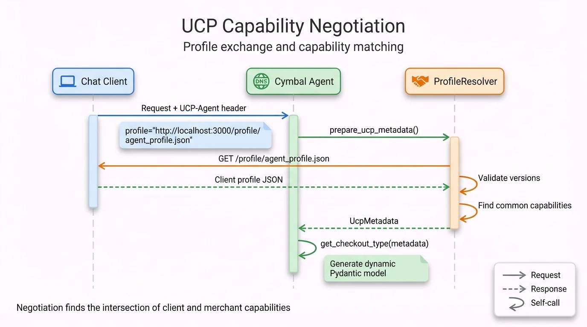
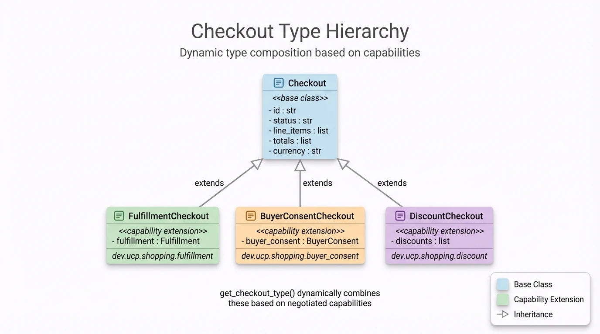

# UCP Integration

## TL;DR

- **UCP** provides standardized commerce data types (Checkout, LineItem, Payment)
- **Capability negotiation** finds common features between client and merchant
- **Dynamic types** generated based on negotiated capabilities

## Why Negotiate Capabilities?

Different commerce platforms support different features. A basic merchant might only support checkout, while an advanced one offers loyalty points, subscriptions, and gift cards.

**Without negotiation**:
- Client assumes all features available → breaks when merchant lacks support
- Merchant sends all data → client can't render unknown fields
- Tight coupling between specific client and merchant versions

**With negotiation**:
- Client declares what it supports: "I can handle checkout, fulfillment, discounts"
- Merchant declares what it offers: "I support checkout, fulfillment"
- Intersection becomes the contract: "We'll use checkout + fulfillment"
- Both sides know exactly what data structures to expect

This enables any UCP-compliant client to work with any UCP-compliant merchant.

## UCP Capabilities

| Capability | Purpose | Extends |
|------------|---------|---------|
| `dev.ucp.shopping.checkout` | Base checkout session | - |
| `dev.ucp.shopping.fulfillment` | Shipping address, delivery options | checkout |
| `dev.ucp.shopping.discount` | Promotional codes | checkout |
| `dev.ucp.shopping.buyer_consent` | Consent management | checkout |

## Profile Structure

### Merchant Profile (`data/ucp.json`)

```json
{
  "ucp": {
    "version": "2026-01-11",
    "services": {
      "dev.ucp.shopping": {
        "version": "2026-01-11",
        "spec": "https://ucp.dev/specs/shopping",
        "a2a": {
          "endpoint": "http://localhost:10999/.well-known/agent-card.json"
        }
      }
    },
    "capabilities": [
      {
        "name": "dev.ucp.shopping.checkout",
        "version": "2026-01-11",
        "spec": "https://ucp.dev/specs/shopping/checkout",
        "schema": "https://ucp.dev/schemas/shopping/checkout.json"
      },
      {
        "name": "dev.ucp.shopping.fulfillment",
        "version": "2026-01-11",
        "extends": "dev.ucp.shopping.checkout"
      }
    ]
  },
  "payment": {
    "handlers": [{
      "id": "example_payment_provider",
      "name": "example.payment.provider",
      "version": "2026-01-11"
    }]
  }
}
```

**Note**: Merchant currently supports 2 capabilities (checkout, fulfillment). Client may request more, but negotiation finds the intersection.

### Client Profile (`chat-client/profile/agent_profile.json`)

```json
{
  "ucp": {
    "version": "2026-01-11",
    "capabilities": [
      {"name": "dev.ucp.shopping.checkout"},
      {"name": "dev.ucp.shopping.fulfillment"},
      {"name": "dev.ucp.shopping.discount"},
      {"name": "dev.ucp.shopping.buyer_consent"}
    ]
  }
}
```

## Capability Negotiation

<div align="center">
  
  <p><em>Figure 1: UCP capability negotiation flow — Chat Client sends request with UCP-Agent header, ProfileResolver fetches client profile, validates versions, finds common capabilities, and returns UcpMetadata for dynamic type generation.</em></p>
</div>

### Negotiation Steps

1. **Extract header**: Parse `UCP-Agent: profile="<url>"` from request
2. **Fetch profile**: HTTP GET client's profile URL
3. **Validate version**: Client version must be ≤ merchant version
4. **Find intersection**: Common capabilities between client and merchant
5. **Create metadata**: `UcpMetadata` with shared capabilities

```python
# ucp_profile_resolver.py
def get_ucp_metadata(self, client_profile) -> UcpMetadata:
    client_caps = {(c.name, c.version) for c in client_capabilities}
    common = [m for m in merchant_caps if (m.name, m.version) in client_caps]
    return UcpMetadata(capabilities=common, ...)
```

## Dynamic Type Generation

Based on negotiated capabilities, a custom `Checkout` class is created:

```python
# helpers/type_generator.py
def get_checkout_type(ucp_metadata: UcpMetadata) -> type[Checkout]:
    active = {cap.name for cap in ucp_metadata.capabilities}
    bases = []

    if "dev.ucp.shopping.fulfillment" in active:
        bases.append(FulfillmentCheckout)
    if "dev.ucp.shopping.buyer_consent" in active:
        bases.append(BuyerConsentCheckout)
    if "dev.ucp.shopping.discount" in active:
        bases.append(DiscountCheckout)

    if not bases:
        return Checkout

    return create_model("DynamicCheckout", __base__=tuple(bases))
```

### Type Hierarchy

<div align="center">
  
  <p><em>Figure 2: Checkout type hierarchy — Base Checkout class is extended by FulfillmentCheckout, BuyerConsentCheckout, and DiscountCheckout based on negotiated capabilities. The get_checkout_type() function dynamically combines these at runtime.</em></p>
</div>

**Dynamic composition**: If both `fulfillment` and `discount` capabilities are negotiated, `get_checkout_type()` creates a class that inherits from both.

## UCP SDK Usage

### Import Patterns

```python
# Checkout types
from ucp_sdk.models.schemas.shopping.checkout_resp import CheckoutResponse
from ucp_sdk.models.schemas.shopping.checkout import Checkout, FulfillmentCheckout

# Common types
from ucp_sdk.models.schemas.shopping.types.line_item import LineItem
from ucp_sdk.models.schemas.shopping.types.payment_response import PaymentResponse
from ucp_sdk.models.schemas.shopping.types.order_confirmation import OrderConfirmation

# Fulfillment
from ucp_sdk.models.schemas.shopping.types.fulfillment_option_response import FulfillmentOptionResponse
from ucp_sdk.models.schemas.shopping.types.postal_address import PostalAddress
```

### Response Keys

```python
# constants.py
UCP_CHECKOUT_KEY = "a2a.ucp.checkout"           # Checkout data
UCP_PAYMENT_DATA_KEY = "a2a.ucp.checkout.payment_data"  # Payment instrument
UCP_RISK_SIGNALS_KEY = "a2a.ucp.checkout.risk_signals"  # Risk data
```

## Adding a New Capability

1. **Update merchant profile** (`data/ucp.json`):
```json
{
  "capabilities": [
    ...,
    {"name": "dev.ucp.shopping.new_capability", "extends": "checkout"}
  ]
}
```

2. **Update type generator** (`helpers/type_generator.py`):
```python
if "dev.ucp.shopping.new_capability" in active:
    bases.append(NewCapabilityCheckout)
```

3. **Handle in tools** if new fields need processing
