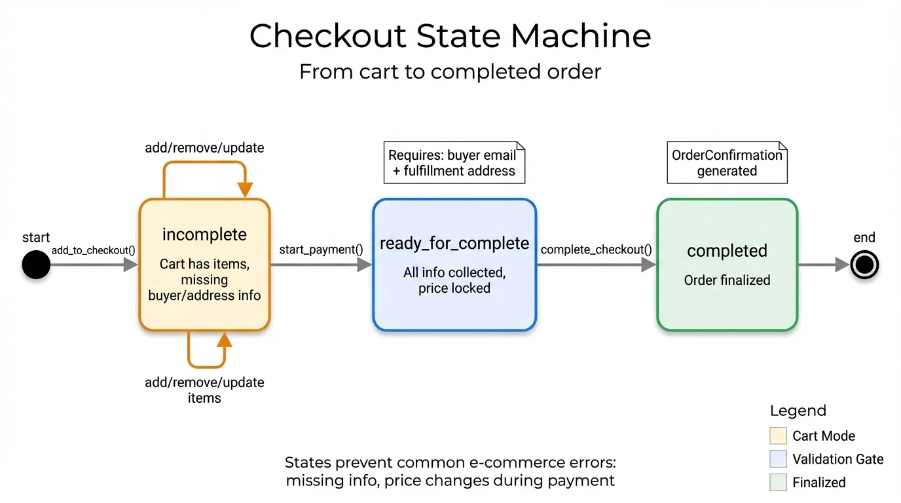
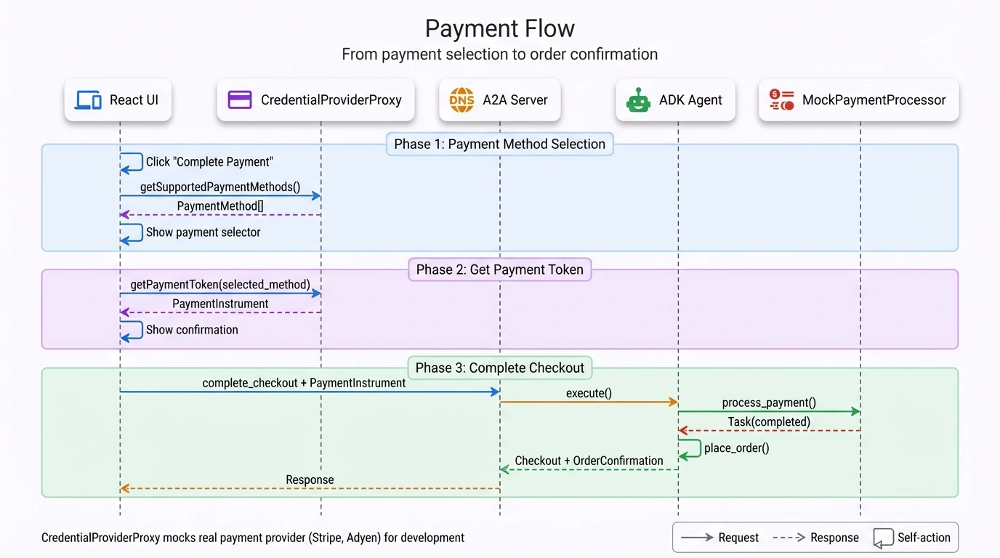

# Commerce Flows

## TL;DR

- **Checkout states**: `incomplete` → `ready_for_complete` → `completed`
- **Payment flow**: Select method → Get token → Complete checkout
- **Totals**: Recalculated on every change (subtotal, tax, shipping)

## Why 3 States?

The checkout state machine prevents common e-commerce errors:

| State | Purpose |
|-------|---------|
| `incomplete` | Cart mode - freely add/remove items, no commitment yet |
| `ready_for_complete` | Validation gate - all required info collected, price locked |
| `completed` | Finalized - order placed, no modifications possible |

**Why not just "in cart" and "ordered"?**

The `ready_for_complete` state serves as a critical checkpoint:
- Validates buyer email exists (for order confirmation)
- Validates shipping address (for fulfillment)
- Locks in pricing (prevents race conditions during payment)
- Allows payment provider to assess risk before charging

Without this intermediate state, you'd risk creating orders with missing shipping info or charging cards for outdated prices.

## Checkout State Machine

<div align="center">
  
  <p><em>Figure 1: Checkout state machine showing the 3 states — incomplete (cart mode), ready_for_complete (validation gate), and completed (finalized). Transitions are triggered by tool calls: add_to_checkout(), start_payment(), and complete_checkout().</em></p>
</div>

### State Definitions

| State | Meaning | Missing |
|-------|---------|---------|
| `incomplete` | Cart has items but missing info | Buyer email or fulfillment address |
| `ready_for_complete` | All info collected | Awaiting payment confirmation |
| `completed` | Order placed | - |

### Transition Triggers

| From | To | Tool | Condition |
|------|----|----- |-----------|
| - | incomplete | `add_to_checkout` | First item added |
| incomplete | ready_for_complete | `start_payment` | Buyer + address present |
| ready_for_complete | completed | `complete_checkout` | Payment validated |

## Checkout Object Structure

```json
{
  "id": "checkout-uuid",
  "status": "incomplete",
  "currency": "USD",

  "line_items": [{
    "id": "item-uuid",
    "item": {
      "id": "PROD-001",
      "title": "Product Name",
      "price": 499,
      "image_url": "http://localhost:10999/images/product.jpg"
    },
    "quantity": 2,
    "totals": [{"type": "subtotal", "amount": 998}]
  }],

  "totals": [
    {"type": "subtotal", "display_text": "Subtotal", "amount": 998},
    {"type": "tax", "display_text": "Tax (10%)", "amount": 100},
    {"type": "shipping", "display_text": "Shipping", "amount": 500},
    {"type": "total", "display_text": "Total", "amount": 1598}
  ],

  "fulfillment": {
    "destination": {"address": {...}},
    "groups": [{"selected_method": {...}}]
  },

  "payment": {
    "handlers": [{"id": "provider", "name": "example.payment.provider"}]
  },

  "order": {
    "id": "order-uuid",
    "permalink_url": "https://example.com/order?id=order-uuid"
  }
}
```

**Note**: Prices are in **cents** (e.g., `499` = $4.99)

## Payment Flow

<div align="center">
  
  <p><em>Figure 2: End-to-end payment flow showing 3 phases — Payment Method Selection (UI ↔ CredentialProviderProxy), Get Payment Token, and Complete Checkout (UI → A2A Server → ADK Agent → MockPaymentProcessor). The agent calls place_order() after payment validation.</em></p>
</div>

### Payment Components

| Component | Location | Role |
|-----------|----------|------|
| CredentialProviderProxy | `chat-client/mocks/` | Mock payment method provider |
| PaymentMethodSelector | `chat-client/components/` | UI for method selection |
| MockPaymentProcessor | `business_agent/payment_processor.py` | Simulates payment validation |

### PaymentInstrument Structure

```json
{
  "type": "card",
  "last_digits": "1111",
  "brand": "AMEX",
  "expiry": "12/2026",
  "handler_id": "example_payment_provider",
  "handler_name": "example.payment.provider",
  "credential": {
    "type": "card_token",
    "token": "mock_token_abc123"
  }
}
```

## Total Calculation

`_recalculate_checkout()` in `store.py` updates all totals:

```python
def _recalculate_checkout(self, checkout: Checkout) -> None:
    subtotal = 0

    # 1. Line item totals
    for item in checkout.line_items:
        item_total = item.item.price * item.quantity
        item.totals = [Total(type="subtotal", amount=item_total)]
        subtotal += item_total

    # 2. Tax (10% flat rate, only if address set)
    tax = subtotal // 10 if has_fulfillment_address else 0

    # 3. Shipping (from selected method)
    shipping = selected_method.price if selected_method else 0

    # 4. Grand total
    total = subtotal + tax + shipping

    # 5. Update checkout.totals
    checkout.totals = [
        Total(type="subtotal", amount=subtotal),
        Total(type="tax", amount=tax),
        Total(type="shipping", amount=shipping),
        Total(type="total", amount=total),
    ]
```

### Fulfillment Options

```python
# store.py:525 - _get_fulfillment_options()
[
    FulfillmentOptionResponse(
        id="standard",
        title="Standard Shipping",
        description="Arrives in 4-5 days",
        carrier="USPS",
        totals=[
            Total(type="subtotal", display_text="Subtotal", amount=500),
            Total(type="tax", display_text="Tax", amount=0),
            Total(type="total", display_text="Total", amount=500),
        ],
    ),
    FulfillmentOptionResponse(
        id="express",
        title="Express Shipping",
        description="Arrives in 1-2 days",
        carrier="FedEx",
        totals=[
            Total(type="subtotal", display_text="Subtotal", amount=1000),
            Total(type="tax", display_text="Tax", amount=0),
            Total(type="total", display_text="Total", amount=1000),
        ],
    ),
]
```

## OrderConfirmation

Created in `place_order()` when checkout completes (store.py:498):

```python
checkout.status = "completed"
checkout.order = OrderConfirmation(
    id=order_id,
    permalink_url=f"https://example.com/order?id={order_id}",
)
```
