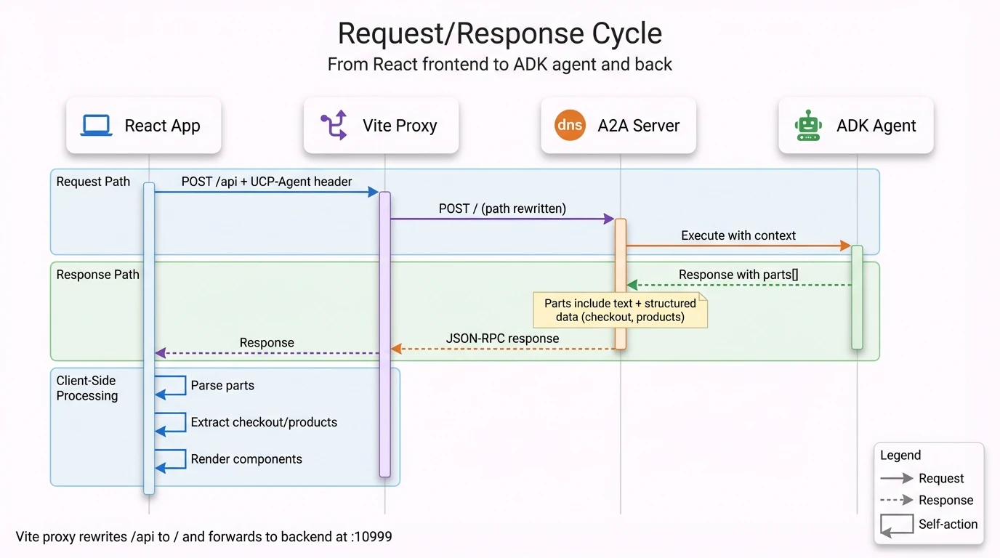
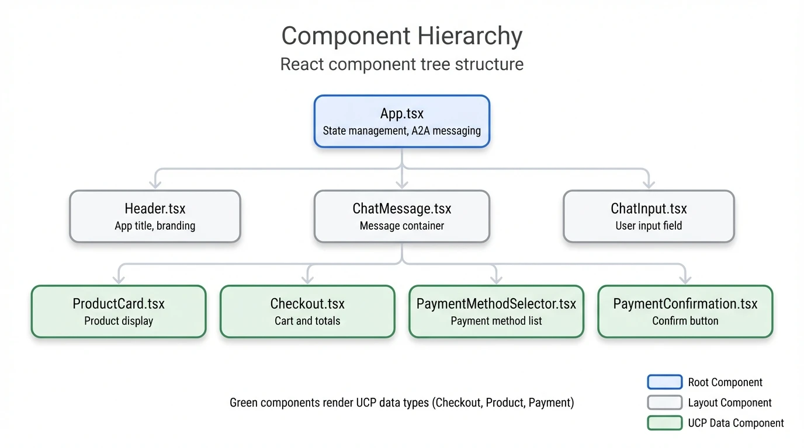

# Frontend Reference

## TL;DR

- **React 19** + TypeScript + Vite + Tailwind
- **App.tsx** handles A2A messaging and state
- **Components** render UCP data types (Checkout, Product, Payment)

## Why a Mock Payment Provider?

Real payment flows involve sensitive credentials and complex integrations. The `CredentialProviderProxy` mock lets you:

- **Test the full checkout flow** without real payment credentials
- **Understand the data contracts** before implementing real providers
- **Demonstrate UCP patterns** without external dependencies

In production, you'd replace this with your actual payment SDK (Stripe, Adyen, etc.).

## Request/Response Cycle

<div align="center">
  
  <p><em>Figure 1: Request/response cycle — React App sends POST /api with UCP-Agent header, Vite Proxy rewrites path and forwards to A2A Server at :10999, ADK Agent returns response with parts[] containing text and structured data (checkout, products).</em></p>
</div>

## Component Hierarchy

<div align="center">
  
  <p><em>Figure 2: React component tree — App.tsx manages state and A2A messaging, with Header, ChatMessage, and ChatInput as children. ChatMessage contains UCP data components (green): ProductCard, Checkout, PaymentMethodSelector, and PaymentConfirmation.</em></p>
</div>

## App.tsx - State & Handlers

### State

```typescript
const [messages, setMessages] = useState<ChatMessage[]>([initialMessage]);
const [isLoading, setIsLoading] = useState(false);
const [contextId, setContextId] = useState<string | null>(null);
const [taskId, setTaskId] = useState<string | null>(null);
```

### Handler Functions

| Handler | Purpose |
|---------|---------|
| `handleSendMessage(content, options)` | Send A2A message, parse response |
| `handleAddToCheckout(product)` | Add product to cart |
| `handleStartPayment()` | Initiate payment flow |
| `handlePaymentMethodSelection(checkout)` | Fetch available methods |
| `handlePaymentMethodSelected(method)` | Get payment token |
| `handleConfirmPayment(instrument)` | Complete checkout |

## A2A Communication

### Request Format

```typescript
const request = {
  jsonrpc: "2.0",
  id: crypto.randomUUID(),
  method: "message/send",
  params: {
    message: {
      role: "user",
      parts: [{type: "text", text: "show me cookies"}],
      contextId: contextId,  // From previous response
      taskId: taskId,        // For multi-turn tasks
    },
    configuration: { historyLength: 0 }
  }
};

fetch("/api", {
  method: "POST",
  headers: {
    "Content-Type": "application/json",
    "X-A2A-Extensions": "https://ucp.dev/specification/reference?v=2026-01-11",
    "UCP-Agent": `profile="http://localhost:3000/profile/agent_profile.json"`
  },
  body: JSON.stringify(request)
});
```

### Response Parsing

```typescript
const data = await response.json();

// Extract context for next request
setContextId(data.result?.contextId);

// Parse response parts
for (const part of data.result?.status?.message?.parts || []) {
  if (part.text) {
    message.text += part.text;
  }
  if (part.data?.["a2a.product_results"]) {
    message.products = part.data["a2a.product_results"].results;
  }
  if (part.data?.["a2a.ucp.checkout"]) {
    message.checkout = part.data["a2a.ucp.checkout"];
  }
}
```

## Key Components

| Component | Props | Renders |
|-----------|-------|---------|
| `ProductCard` | `product`, `onAddToCart` | Product image, name, price, stock |
| `Checkout` | `checkout`, `onCheckout`, `onCompletePayment` | Line items, totals, action buttons |
| `PaymentMethodSelector` | `paymentMethods`, `onSelect` | Radio list of methods |
| `PaymentConfirmation` | `paymentInstrument`, `onConfirm` | Confirm button |
| `ChatMessage` | `message`, handlers | Combines all above based on data |

## Types (types.ts)

```typescript
interface ChatMessage {
  id: string;
  sender: Sender;          // USER | MODEL
  text: string;
  products?: Product[];
  isLoading?: boolean;
  paymentMethods?: PaymentMethod[];
  isUserAction?: boolean;
  checkout?: Checkout;
  paymentInstrument?: PaymentInstrument;
}

interface Checkout {
  id: string;
  line_items: CheckoutItem[];
  currency: string;
  continue_url?: string | null;
  status: string;          // incomplete | ready_for_complete | completed
  totals: CheckoutTotal[];
  order_id?: string;
  order_permalink_url?: string;
  payment?: Payment;
}

interface Product {
  productID: string;
  name: string;
  image: string[];
  brand: { name: string };
  offers: {
    price: string;
    priceCurrency: string;
    availability: string;
  };
  url: string;
  description: string;
  size: { name: string };
}

interface PaymentMethod {
  id: string;
  type: string;
  brand: string;
  last_digits: string;
  expiry_month: number;
  expiry_year: number;
}
```

## CredentialProviderProxy

Mock payment provider in `mocks/credentialProviderProxy.ts`:

```typescript
class CredentialProviderProxy {
  handler_id = 'example_payment_provider';
  handler_name = 'example.payment.provider';

  // Returns mock payment methods (wrapped in object)
  async getSupportedPaymentMethods(
    user_email: string,
    config: any
  ): Promise<{payment_method_aliases: PaymentMethod[]}> {
    return {
      payment_method_aliases: [
        { id: "instr_1", type: "card", brand: "amex",
          last_digits: "1111", expiry_month: 12, expiry_year: 2026 },
        { id: "instr_2", type: "card", brand: "visa",
          last_digits: "8888", expiry_month: 12, expiry_year: 2026 },
      ]
    };
  }

  // Converts method to PaymentInstrument with token
  async getPaymentToken(
    user_email: string,
    payment_method_id: string
  ): Promise<PaymentInstrument | undefined> {
    return {
      ...payment_method,
      handler_id: this.handler_id,
      handler_name: this.handler_name,
      credential: { type: "token", token: `mock_token_${uuid}` }
    };
  }
}
```

## Configuration

### Vite Proxy (`vite.config.ts`)

```typescript
server: {
  port: 3000,
  proxy: {
    "/api": {
      target: "http://localhost:10999",
      changeOrigin: true,
      rewrite: (path) => path.replace(/^\/api/, "")
    }
  }
}
```

### App Config (`config.ts`)

```typescript
export const appConfig = new AppProperties(
  "Business Agent",
  "Your personal shopping assistant.",
  "/images/logo.jpg",
  "Hello, I am your Business Agent...",
  "Shop with Business Agent"
);
```
