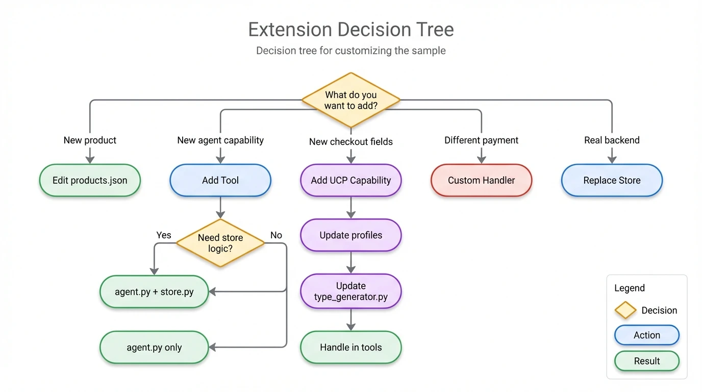
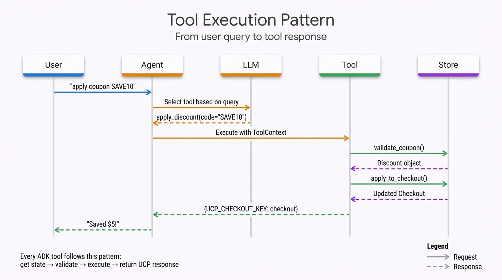
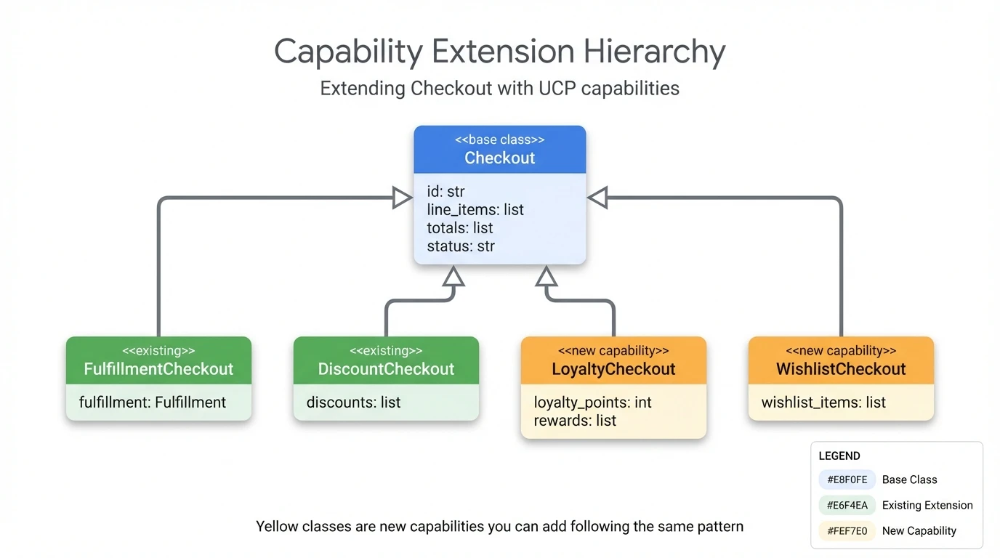
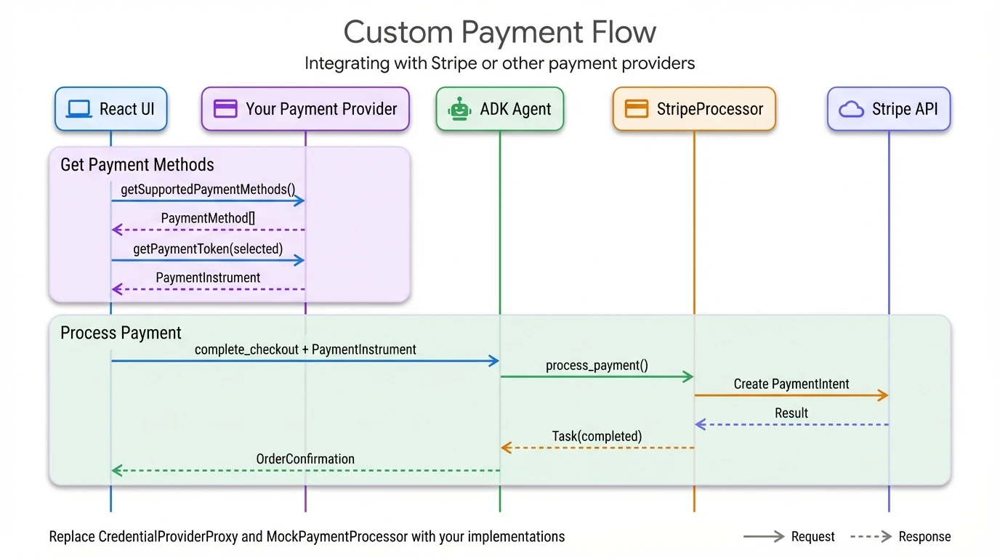

# Extending the Sample

## TL;DR

- **Quick wins**: Add products, modify checkout flow, change tax/shipping
- **Medium effort**: Add new tools, custom payment handlers
- **Advanced**: New UCP capabilities, replace mock store, multi-agent patterns

## Which Extension Do You Need?

<div align="center">
  
  <p><em>Figure 1: Extension decision tree — Choose your path based on what you want to add. New products require only JSON edits, while new capabilities need profile updates, type generation, and tool handling.</em></p>
</div>

---

## Part 1: Quick Customizations

### Add Products

**File**: `data/products.json`

```json
{
  "productID": "SNACK-007",
  "sku": "SNACK-007",
  "name": "Organic Trail Mix",
  "@type": "Product",
  "image": ["http://localhost:10999/images/trail_mix.jpg"],
  "brand": {"name": "Nature's Best", "@type": "Brand"},
  "offers": {
    "price": "6.99",
    "priceCurrency": "USD",
    "availability": "InStock",
    "itemCondition": "NewCondition",
    "@type": "Offer"
  },
  "description": "A healthy mix of nuts and dried fruits",
  "category": "Food > Snacks > Trail Mix"
}
```

Add image to `data/images/`, restart server.

### Modify Tax Calculation

**File**: `store.py` - `_recalculate_checkout()` method

```python
# Current: flat 10% tax
tax = subtotal // 10

# Custom: location-based tax
tax_rate = self._get_tax_rate(checkout.fulfillment.destination.address)
tax = int(subtotal * tax_rate)

def _get_tax_rate(self, address: PostalAddress) -> float:
    state_rates = {"CA": 0.0725, "NY": 0.08, "TX": 0.0625}
    return state_rates.get(address.addressRegion, 0.05)
```

### Add Minimum Order

**File**: `store.py` - `start_payment()` method (line 463)

```python
def start_payment(self, checkout_id: str) -> Checkout | str:
    checkout = self._checkouts.get(checkout_id)

    # Add minimum order check
    subtotal = next(t for t in checkout.totals if t.type == "subtotal").amount
    if subtotal < 1000:  # $10 minimum (cents)
        return "Minimum order is $10.00"

    # ... rest of validation
```

### Custom Shipping Options

**File**: `store.py` - `_get_fulfillment_options()` method (line 525)

```python
def _get_fulfillment_options(self, address: PostalAddress) -> list:
    options = [
        FulfillmentOptionResponse(
            id="standard", title="Standard", price=500,
            description="4-5 business days"
        ),
        FulfillmentOptionResponse(
            id="express", title="Express", price=1000,
            description="1-2 business days"
        ),
    ]
    # Add same-day for local addresses
    if self._is_local(address):
        options.append(FulfillmentOptionResponse(
            id="same_day", title="Same Day", price=1500
        ))
    return options
```

---

## Part 2: Adding Tools (ADK Perspective)

### Tool Architecture

Every ADK tool follows this pattern:

<div align="center">
  
  <p><em>Figure 2: Tool execution pattern — User query flows through Agent → LLM (tool selection) → Tool (with ToolContext) → Store. Each tool follows: get state → validate → execute → return UCP response.</em></p>
</div>

### Template: Creating a New Tool

```python
# agent.py

def my_new_tool(tool_context: ToolContext, param: str) -> dict:
    """Docstring becomes the LLM's understanding of this tool.

    Args:
        param: Description helps LLM know what to pass

    Returns:
        Description of what the tool returns
    """
    # 1. Get state
    checkout_id = tool_context.state.get(ADK_USER_CHECKOUT_ID)
    metadata = tool_context.state.get(ADK_UCP_METADATA_STATE)

    # 2. Validate
    if not checkout_id:
        return _create_error_response("No active checkout")

    # 3. Execute business logic
    try:
        result = store.my_method(checkout_id, param)
    except ValueError as e:
        return _create_error_response(str(e))

    # 4. Return UCP-formatted response
    return {UCP_CHECKOUT_KEY: result.model_dump(mode="json")}
```

### Example: Apply Discount Tool

```python
def apply_discount(tool_context: ToolContext, promo_code: str) -> dict:
    """Apply a promotional code to the current checkout.

    Args:
        promo_code: The promotional code to apply (e.g., "SAVE10")
    """
    checkout_id = tool_context.state.get(ADK_USER_CHECKOUT_ID)
    if not checkout_id:
        return _create_error_response("No active checkout")

    try:
        checkout = store.apply_discount(checkout_id, promo_code)
        return {UCP_CHECKOUT_KEY: checkout.model_dump(mode="json")}
    except ValueError as e:
        return _create_error_response(str(e))

# Add to agent tools list
root_agent = Agent(..., tools=[...existing..., apply_discount])
```

### Example: Order Tracking Tool

```python
def get_order_status(tool_context: ToolContext, order_id: str) -> dict:
    """Get the status of a placed order.

    Args:
        order_id: The order ID from order confirmation
    """
    order = store.get_order(order_id)
    if not order:
        return _create_error_response("Order not found")

    return {
        "order": {
            "id": order.order.id,
            "status": "shipped",  # or "processing", "delivered"
            "tracking_number": "1Z999AA10123456784",
            "estimated_delivery": "2026-01-25",
            "permalink_url": order.order.permalink_url,
        }
    }
```

### Example: Product Recommendations Tool

```python
def get_recommendations(
    tool_context: ToolContext,
    rec_type: str = "popular"
) -> dict:
    """Get product recommendations for the customer.

    Args:
        rec_type: Type of recommendations - "popular", "similar", "cart_based"
    """
    checkout_id = tool_context.state.get(ADK_USER_CHECKOUT_ID)

    if rec_type == "cart_based" and checkout_id:
        checkout = store.get_checkout(checkout_id)
        product_ids = [item.item.id for item in checkout.line_items]
        products = store.get_related_products(product_ids)
    elif rec_type == "popular":
        products = store.get_popular_products(limit=4)
    else:
        products = store.search_products("").results[:4]

    return {"a2a.product_results": {"results": products}}
```

---

## Part 3: UCP Capabilities

### Why Capabilities?

UCP capabilities let you extend checkout data in a standardized way. The client and merchant negotiate which capabilities they both support.

<div align="center">
  
  <p><em>Figure 3: Capability extension hierarchy — Base Checkout class extended by FulfillmentCheckout, DiscountCheckout (existing), and LoyaltyCheckout, WishlistCheckout (new capabilities you can add).</em></p>
</div>

### Adding a New Capability

**Step 1**: Update merchant profile (`data/ucp.json`)

```json
{
  "capabilities": [
    ...existing...,
    {
      "name": "dev.ucp.shopping.loyalty",
      "version": "2026-01-11",
      "extends": "dev.ucp.shopping.checkout"
    }
  ]
}
```

**Step 2**: Create checkout type extension

```python
# helpers/type_generator.py or models.py

from pydantic import BaseModel

class Reward(BaseModel):
    id: str
    name: str
    points_required: int

class LoyaltyCheckout(Checkout):
    loyalty_points: int | None = None
    rewards: list[Reward] | None = None
```

**Step 3**: Update type generator (`helpers/type_generator.py`)

```python
def get_checkout_type(ucp_metadata: UcpMetadata) -> type[Checkout]:
    active = {cap.name for cap in ucp_metadata.capabilities}
    bases = []

    if "dev.ucp.shopping.fulfillment" in active:
        bases.append(FulfillmentCheckout)
    if "dev.ucp.shopping.loyalty" in active:  # NEW
        bases.append(LoyaltyCheckout)
    # ... other capabilities

    if not bases:
        return Checkout
    return create_model("DynamicCheckout", __base__=tuple(bases))
```

**Step 4**: Handle in tools (if needed)

```python
def apply_loyalty_points(tool_context: ToolContext, points: int) -> dict:
    """Apply loyalty points to reduce checkout total."""
    checkout_id = tool_context.state.get(ADK_USER_CHECKOUT_ID)
    checkout = store.apply_loyalty_points(checkout_id, points)
    return {UCP_CHECKOUT_KEY: checkout.model_dump(mode="json")}
```

### Example: Wishlist Capability

```python
# 1. Profile: {"name": "dev.ucp.shopping.wishlist", "extends": "checkout"}

# 2. Type
class WishlistCheckout(Checkout):
    wishlist_items: list[str] | None = None  # Product IDs

# 3. Tool
def add_to_wishlist(tool_context: ToolContext, product_id: str) -> dict:
    """Save a product to the customer's wishlist."""
    wishlist = store.add_to_wishlist(user_id, product_id)
    return {"wishlist": wishlist}

def move_to_checkout(tool_context: ToolContext, product_id: str) -> dict:
    """Move a wishlist item to the checkout."""
    # ...
```

---

## Part 4: Payment Customization

### Payment Flow with Custom Handler

<div align="center">
  
  <p><em>Figure 4: Custom payment flow — Replace CredentialProviderProxy with your payment provider and MockPaymentProcessor with your StripeProcessor (or other provider). Shows the complete flow from payment method selection through Stripe API to OrderConfirmation.</em></p>
</div>

### Step 1: Update Profiles

**Merchant** (`data/ucp.json`):
```json
{
  "payment": {
    "handlers": [{
      "id": "stripe_handler",
      "name": "stripe.payment.provider",
      "version": "2026-01-11",
      "config": {"business_id": "acct_123456"}
    }]
  }
}
```

**Client** (`chat-client/profile/agent_profile.json`):
```json
{
  "payment": {
    "handlers": [{
      "id": "stripe_handler",
      "name": "stripe.payment.provider"
    }]
  }
}
```

### Step 2: Implement Payment Processor

```python
# payment_processor.py

import stripe

class StripePaymentProcessor:
    def __init__(self, api_key: str):
        stripe.api_key = api_key

    async def process_payment(
        self,
        payment_data: PaymentInstrument,
        amount: int,
        currency: str,
        risk_data: dict | None = None
    ) -> Task:
        try:
            result = stripe.PaymentIntent.create(
                amount=amount,
                currency=currency.lower(),
                payment_method=payment_data.credential.token,
                confirm=True
            )
            return Task(
                state=TaskState.completed
                if result.status == "succeeded"
                else TaskState.failed
            )
        except stripe.error.CardError as e:
            return Task(state=TaskState.failed, message=str(e))
```

### Step 3: Update Frontend Mock

Replace `CredentialProviderProxy` in `chat-client/mocks/`:

```typescript
class StripeCredentialProvider {
  handler_id = 'stripe_handler';
  handler_name = 'stripe.payment.provider';

  async getSupportedPaymentMethods(email: string) {
    // Call your payment service to get saved methods
    const response = await fetch(`/api/payment-methods?email=${email}`);
    return response.json();
  }

  async getPaymentToken(email: string, method_id: string) {
    // Generate Stripe token
    const { token } = await stripe.createToken(card);
    return {
      ...method,
      credential: { type: "token", token: token.id }
    };
  }
}
```

---

## Part 5: User Journeys

### Journey: Order Tracking

**User Goal**: "Where's my order?"

```
User: "Where's my order?"
→ Agent: Asks for order ID or shows recent orders
User: "Order #ORD-12345"
→ Agent: get_order_status("ORD-12345")
→ Agent: "Your order shipped via FedEx. Tracking: 1Z999..."
User: "Can I change the delivery address?"
→ Agent: Checks if order is shipped
→ Agent: update_delivery() if not shipped, else "Sorry, already shipped"
```

**Tools needed**: `get_order_status`, `get_recent_orders`, `update_delivery`

### Journey: Returns & Refunds

**User Goal**: "I want to return this item"

```
User: "I want to return the cookies I ordered"
→ Agent: get_recent_orders() - finds order with cookies
→ Agent: "Found cookies in order #ORD-12345. Why the return?"
User: "They arrived damaged"
→ Agent: initiate_return(order_id, item_id, reason="damaged")
→ Agent: "Return approved. Shipping label sent to your email.
         Refund of $4.99 will process when we receive the item."
```

**Tools needed**: `get_recent_orders`, `initiate_return`, `get_return_status`

### Journey: Smart Recommendations

**User Goal**: Discover related products

```
User: Adds cookies to cart
→ Agent: After add_to_checkout callback
→ Agent: get_recommendations("cart_based")
→ Agent: "Customers who bought these cookies also liked:
         - Organic Milk ($3.99)
         - Hot Cocoa Mix ($5.99)"
User: "Show me similar cookies"
→ Agent: get_recommendations("similar", product_id="COOKIE-001")
→ Agent: Shows 4 similar cookie products
```

**Tools needed**: `get_recommendations` (with types: popular, similar, cart_based)

### Journey: Guest vs Returning Customer

**Guest User**:
```
User: Adds items, enters email: new@example.com
→ Agent: No saved addresses, asks for full address
→ Agent: No saved payment methods, shows all options
```

**Returning Customer**:
```
User: Adds items, enters email: returning@example.com
→ Agent: get_saved_addresses(email)
→ Agent: "Ship to 123 Main St (your default)?"
User: "Yes"
→ Agent: get_saved_payment_methods(email)
→ Agent: "Pay with Visa ending 4242?"
```

**Tools needed**: `get_saved_addresses`, `get_saved_payment_methods`

---

## Part 6: Replacing the Mock Store

See [Architecture: Mock Store](./01-architecture.md#mock-store-architecture) for:
- Store structure diagram
- Key methods to implement
- Interface definition
- Adapter pattern example
- What to keep vs replace

Quick summary:

| Keep (UCP/ADK patterns) | Replace (Mock specifics) |
|-------------------------|--------------------------|
| Tool signatures | Data storage |
| State management | Product catalog |
| Type generation | Tax/shipping logic |
| Response formatting | Payment processing |
