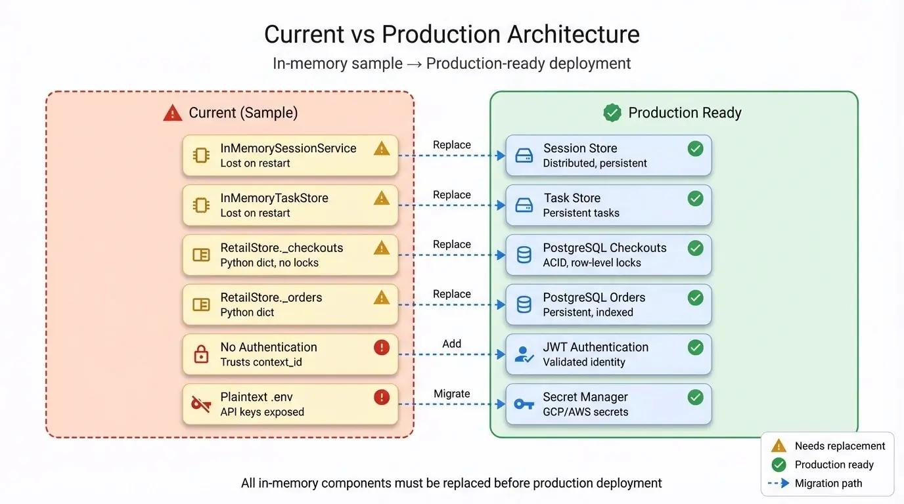
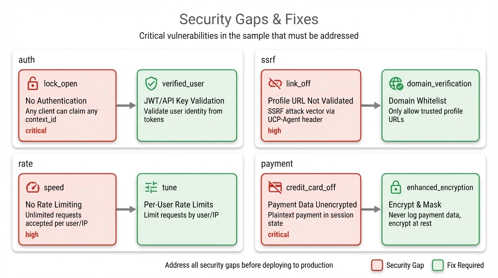

# Production Notes

> **WARNING**: This sample is NOT production-ready. This document explains what changes are needed before deploying to production.

## TL;DR

- In-memory state loses data on restart
- No authentication or rate limiting
- No health check endpoints
- See deployment checklist below

---

## Architecture Limitations

<div align="center">
  
  <p><em>Figure 1: In-memory sample components vs production-ready replacements</em></p>
</div>

| Component | Current State | Production Requirement |
|-----------|---------------|------------------------|
| Session Storage | `InMemorySessionService` (lost on restart) | Redis or database |
| Task Storage | `InMemoryTaskStore` (lost on restart) | Persistent task store |
| Checkout Storage | `RetailStore._checkouts` dict (in-memory) | PostgreSQL or similar |
| Order Storage | `RetailStore._orders` dict (in-memory) | PostgreSQL or similar |
| Concurrency | No locking on `_checkouts` | Checkout-level locks |
| Authentication | None (trusts `context_id`) | JWT or API key validation |
| Secrets | Plaintext .env | Secret Manager (GCP/AWS) |

**Key insight**: The `RetailStore` class (in `store.py`) stores all business data in plain Python dictionaries:
- `self._checkouts = {}` — All active checkout sessions
- `self._orders = {}` — All completed orders
- `self._products` — Product catalog (loaded from JSON)

These are lost on restart and have no concurrency protection.

---

## Security Gaps

<div align="center">
  
  <p><em>Figure 2: Four critical security vulnerabilities and their required fixes</em></p>
</div>

### 1. No Authentication

Any client can claim any `context_id`. In production, validate user identity from JWTs or API keys.

```python
# Current (insecure)
user_id = context.context_id  # Trusts client-provided value

# Production
user_id = validate_jwt(context.headers.get("Authorization"))
```

### 2. Profile URL Not Validated

The `UCP-Agent` header can point to any URL. A malicious client could point to:
- Internal services (SSRF attack)
- Slow servers (DoS the agent startup)

```python
# Production: Whitelist allowed domains
ALLOWED_DOMAINS = ["localhost", "trusted-partner.com"]
parsed = urlparse(client_profile_url)
if parsed.netloc not in ALLOWED_DOMAINS:
    raise ValueError("Untrusted profile URL")
```

### 3. No Rate Limiting

Unlimited requests are accepted. Add rate limiting per user/IP.

### 4. Payment Data Unencrypted

Payment instruments are stored as plaintext in session state. If logs capture state, card data leaks.

```python
# Production: Never log payment data
logger.info(f"Processing payment for checkout {checkout_id}")
# NOT: logger.info(f"Payment data: {payment_data}")
```

---

## Concurrency Issues

### Race Condition in Checkout

Between `start_payment()` and `complete_checkout()`, another request could:
- Add items (changing the total)
- Change the address (affecting tax)
- Call `start_payment()` again

**Fix**: Add checkout-level locking.

```python
# Production pattern
async def add_to_checkout(checkout_id: str, ...):
    async with self.get_lock(checkout_id):
        # Safe from concurrent modifications
        checkout = self._checkouts[checkout_id]
        checkout.line_items.append(...)
```

### Duplicate Items on Retry

If a network error causes the client to retry `add_to_checkout`, items are duplicated.

**Fix**: Implement idempotency via client-provided keys.

```python
def add_to_checkout(
    tool_context: ToolContext,
    product_id: str,
    quantity: int,
    idempotency_key: str | None = None  # Client-provided
) -> dict:
    if idempotency_key and idempotency_key in self.processed_requests:
        return self.processed_requests[idempotency_key]
    # ... proceed with add ...
```

---

## Deployment Checklist

### Required Before Production

**Infrastructure:**
- [ ] Create Dockerfile with non-root user
- [ ] Add `/health` endpoint (liveness probe)
- [ ] Add `/ready` endpoint (readiness probe)
- [ ] Configure Kubernetes manifests or Cloud Run

**State Management:**
- [ ] Replace `InMemorySessionService` with Redis-backed store
- [ ] Replace `InMemoryTaskStore` with persistent store
- [ ] Replace `RetailStore._checkouts` dict with database (PostgreSQL)
- [ ] Replace `RetailStore._orders` dict with database
- [ ] Add session TTL and cleanup

**Security:**
- [ ] Add request authentication (JWT/API key)
- [ ] Validate profile URLs against whitelist
- [ ] Move `GOOGLE_API_KEY` to Secret Manager
- [ ] Add rate limiting per user

**Observability:**
- [ ] Add structured JSON logging
- [ ] Add Prometheus metrics endpoint
- [ ] Add request tracing (OpenTelemetry)

**Reliability:**
- [ ] Add checkout-level locking
- [ ] Implement idempotency for state-changing operations
- [ ] Add circuit breaker for Gemini API calls

---

## Scaling Considerations

### Session Affinity

If running multiple replicas, all requests for a session must go to the same instance (or use shared storage).

```yaml
# Kubernetes: Enable session affinity
spec:
  sessionAffinity: ClientIP
```

### LLM Call Blocking

Each `runner.run_async()` call blocks until the LLM responds (2-5 seconds typical). With synchronous execution, you need one thread per concurrent user.

**Consider**: Async runner with connection pooling.

### Gemini API Rate Limits

The Gemini API has rate limits. Add a circuit breaker to fail fast when limits are hit.

---

## Sample Dockerfile

```dockerfile
FROM python:3.13-slim

# Create non-root user
RUN useradd -m agent

WORKDIR /app

# Copy files
COPY --chown=agent:agent . .

# Install dependencies
RUN pip install uv && uv sync

# Switch to non-root user
USER agent

# Expose port
EXPOSE 10999

# Health check
HEALTHCHECK --interval=30s --timeout=5s --start-period=10s \
    CMD curl -f http://localhost:10999/health || exit 1

# Run
CMD ["uv", "run", "business_agent"]
```

---

## Sample Health Check Endpoint

Add to `main.py`:

```python
@app.route("/health", methods=["GET"])
async def health(request: Request) -> JSONResponse:
    return JSONResponse({"status": "healthy"})

@app.route("/ready", methods=["GET"])
async def ready(request: Request) -> JSONResponse:
    # Check dependencies here
    try:
        # Verify store is accessible
        _ = store.products
        return JSONResponse({"status": "ready"})
    except Exception as e:
        return JSONResponse({"status": "not_ready", "error": str(e)}, status_code=503)
```

---

## Environment Variables

Externalize these hardcoded values:

| Variable | Current | Purpose |
|----------|---------|---------|
| `AGENT_HOST` | `localhost` | Bind address |
| `AGENT_PORT` | `10999` | Listen port |
| `LOG_LEVEL` | `INFO` | Logging verbosity |
| `GOOGLE_API_KEY` | `.env` file | Gemini API access |
| `SESSION_TTL` | Unlimited | Session expiration (seconds) |
| `REDIS_URL` | N/A | Distributed session storage |

---

## Related Documentation

- [Architecture](01-architecture.md) - System design
- [Testing Guide](07-testing-guide.md) - Debugging and troubleshooting
